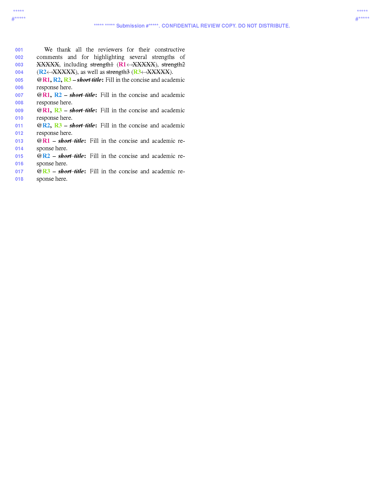

# Conference Rebuttal Template

A clean and reusable LaTeX template for preparing **conference rebuttals** (also called **author responses**) in a clear and compact format.

This project is based on the **CVPR 2026 rebuttal template** and is intended as a lightweight starting point for researchers who want to:

- respond to multiple reviewers in a structured way,
- group shared concerns across reviewers,
- keep individual responses concise and easy to scan,
- reuse a familiar CVPR-style rebuttal layout.

## Preview

Below is a quick preview of the compiled template.



## Features

- CVPR-style rebuttal layout
- Ready-to-edit `main.tex` entry file
- Color-coded reviewer references (`R1`, `R2`, `R3`)
- Predefined blocks for shared and reviewer-specific responses
- Minimal project structure for quick reuse

## Repository Structure

```text
conference-rebuttal-template/
├── README.md
├── main.tex
├── LICENSE
├── preamble.tex
├── cvpr.sty
├── figures/
│   └── pdf_file_thumbnail.png
└── sec/
    └── tex/
        └── rebuttal.tex
```

## Usage

1. Clone or download this repository.
2. Edit the metadata in `main.tex`, including the paper ID and title.
3. Replace the placeholder text in `sec/tex/rebuttal.tex` with your own rebuttal content.
4. Compile `main.tex` using `pdflatex`.

## Citation

If this template helps your workflow, a GitHub star or attribution in your own repository is appreciated.

```bibtex
@misc{conference_rebuttal_template_2026,
  title        = {Conference Rebuttal Template},
  author       = {Qiyu Chen},
  year         = {2026},
  howpublished = {GitHub repository},
  note         = {Based on the CVPR 2026 rebuttal template},
  url          = {https://github.com/<your-username>/conference-rebuttal-template}
}
```

## Acknowledgment

This template is adapted from the official **[CVPR 2026 author kit](https://github.com/cvpr-org/author-kit)** and rebuttal template provided by the CVPR organizers.
